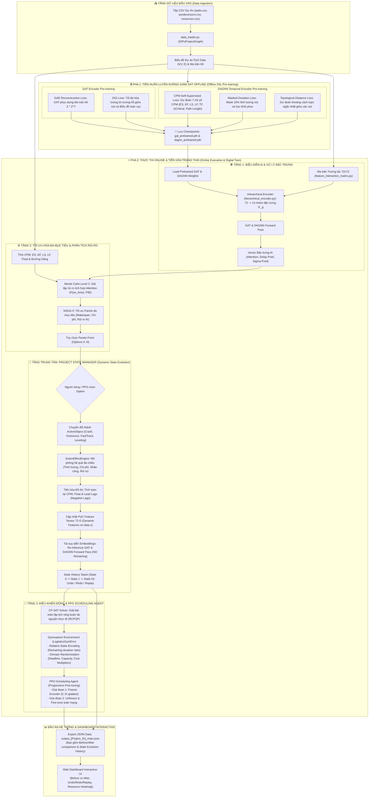
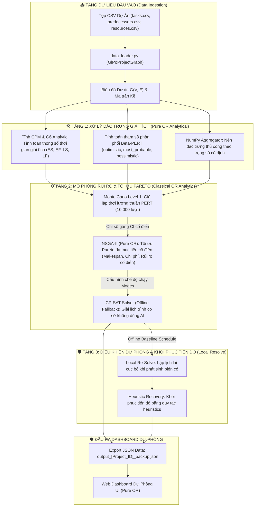

# Sơ đồ Luồng Dữ liệu (Data Workflow) - Kiến Trúc 3 Tầng GLPO

Tài liệu này đặc tả chi tiết luồng dữ liệu (Data Workflow) chạy qua hai nhánh xử lý song song: **Nhánh chính (Main Pipeline: AI + OR + RL)** và **Nhánh dự phòng (Backup Pipeline: Pure OR)**, bám sát kiến trúc 3 tầng của hệ thống quản lý tiến độ và chi phí logistics (GLPO).

---

## 1. Sơ đồ Luồng Dữ liệu Tổng thể (Mermaid Diagrams)

### 1.1. Sơ đồ Luồng Dữ liệu Nhánh Chính (Main Pipeline: AI + OR + RL + State Manager)



### 1.1.2. Mô tả Luồng Hoạt động Nhánh Chính từ Đầu đến Cuối (End-to-End Workflow)

Để hiểu một cách trực quan, luồng vận hành của nhánh chính được ví như một chuỗi cung ứng khép kín đi qua 5 trạm chính:

1. **Trạm 1: Nạp & Sơ chế Dữ liệu (Data Loader & Prep)**
   * **Đầu vào:** Hệ thống tiếp nhận các bảng thông tin dự án thô (`tasks.csv`, `predecessors.csv`, `resources.csv`).
   * **Xử lý:** `data_loader.py` xây dựng cấu trúc đồ thị PyG.
   * **Xử lý Đặc trưng 72-D:** Tích hợp và trích xuất ma trận 72 đặc trưng công việc cho từng nút nút (bao gồm chi phí trực tiếp/gián tiếp, thời lượng, tài nguyên, rủi ro, ESG, và cấu trúc tô-pô ban đầu).
   * **Chuẩn hóa tối ưu:** Các đặc trưng có giá trị lớn (chi phí tiền tỷ VNĐ hay thời lượng hàng ngàn giờ) lập tức được biến đổi logarithm (`log(1 + x)`) và đưa về dải chuẩn hóa đẹp mắt $[0, 1]$, giúp mô hình nơ-ron không bị trôi lệch tham số do chênh lệch thang đo.

2. **Trạm 2: Đọc Hiểu Đồ thị Dự án (Offline Self-Supervised Learning)**
   * **Xử lý:** Đồ thị dự án được đưa qua 2 bộ học tự giám sát:
     * **GAT (Mã hóa Không gian cấu trúc):** Nhận diện các liên kết công việc quan trọng kề nhau (GAE) và bao quát ngữ cảnh vị trí toàn cục (DGI).
     * **DAGNN (Mã hóa Động học thời gian):** Dự đoán các thông số thời gian giải tích (CPM), tự khôi phục thông tin thời lượng khi bị che khuất (Masked Duration) và nắm giữ khoảng cách tô-pô thực tế (Topo Distance).
   * **Điểm nhấn:** Các mô hình này được huấn luyện offline trước để nắm chắc đặc trưng của dự án và lưu Checkpoints.

3. **Trạm 3: Đánh giá Rủi ro & Tối ưu đa mục tiêu (Online Risk & Pareto Front)**
   * **Xử lý:** Hệ thống nạp trọng số đã học để chạy truyền xuôi (Forward Pass) tạo ra các vector nhúng (Embeddings) nén 32 chiều giàu ngữ cảnh.
   * **Monte Carlo Level 2** kết hợp cơ chế chú ý (attention) để giả lập rủi ro tiến độ thực tế (tính toán xác suất đúng hạn $P_{on\_time}$).
   * **NSGA-II** tìm kiếm biên Pareto tối ưu, xuất ra các lựa chọn lịch trình đánh đổi tốt nhất (giảm thời gian, giảm chi phí, giảm rủi ro).

4. **Trạm 4: Tiến hóa Trạng thái Động (Dynamic State Manager - Digital Twin)**
   * **Xử lý:** Khi người dùng hoặc AI chọn một phương án (Option), **ActionEffectEngine** mô phỏng tác động tức thì của hành động lên từng công việc (như Crash rút ngắn thời lượng, Fast Tracking gối đầu công việc song song).
   * **Tính toán lại:** Thuật toán CPM chạy lại tự động để tính toán lượng dự trữ mới (`Total Float`) và dịch chuyển đường găng mới (`Critical Path`).
   * **Cập nhật Đặc trưng 72-D:** Bộ quản lý trạng thái tự động cập nhật các thuộc tính mới (thời lượng, chi phí, cờ đường găng `Is Critical` mới, `Total Float` mới, v.v.) **trực tiếp lên tensor 72-D `data.x` của đồ thị PyG trong bộ nhớ** mà không cần đọc lại từ CSV thô.
   * **Tái suy diễn:** Tensor đặc trưng `data.x` sau khi cập nhật động sẽ được truyền xuôi lại qua GAT/DAGNN để sinh Embedding mới mà **không cần train lại**.
   * **Lịch sử:** Mọi thay đổi được lưu trữ vào Stack lịch sử để sẵn sàng cho các lệnh Hoàn tác (`Undo`), Làm lại (`Redo`), hoặc Xem lại (`Replay`).

5. **Trạm 5: Lập lịch Ràng buộc Tài nguyên & RL Control (CP-SAT & PPO Agent)**
   * **Xử lý:** Mô hình CP-SAT giải quyết ràng buộc tài nguyên thực tế để xuất bản lịch trình khả thi tối ưu.
   * **Điều khiển động:** PPO Agent điều khiển động lịch trình thích nghi linh hoạt với các biến động rủi ro ngẫu nhiên từ môi trường Gymnasium.
   * **Đầu ra:** Toàn bộ lịch trình chi tiết và lịch sử biến đổi được xuất ra tệp tin JSON để kết xuất lên giao diện Web Dashboard tương tác trực quan cho người dùng.

---

### 1.2. Sơ đồ Luồng Dữ liệu Nhánh Dự Phòng (Backup Pipeline: Pure OR)



---

---

## 2. Chi tiết các File và Mô-đun trong Nhánh Chính (Main Pipeline: AI + OR + RL + State Manager)

Nhánh chính kết hợp sức mạnh của **Graph Machine Learning (GNN)**, **Operations Research (OR)**, **Dynamic Project State Evolution (Digital Twin)** và **Deep Reinforcement Learning (PPO)**.

### 📥 2.1 Tiền xử lý dữ liệu & Biểu diễn Đặc trưng (Layer 1: AI Representation)
* **[data_loader.py](file:///c:/CNTT/KY8-2026/Logistics-Project-Progress-Cost-Management/ai_pipeline/models/data_loader.py) (`GlPoProjectGraph` & `GlPoDataset`):** Đọc dữ liệu CSV thô (`tasks.csv`, `predecessors.csv`, `resources.csv`, `agenda_*.csv`), tự động tính 8 đặc trưng tô-pô ban đầu và ép khuôn ma trận 72 đặc trưng ($60$ đặc trưng người dùng $+ 12$ đặc trưng AI) trên đối tượng PyTorch Geometric `Data`.
* **[feature_interaction_matrix.py](file:///c:/CNTT/KY8-2026/Logistics-Project-Progress-Cost-Management/ai_pipeline/models/feature_interaction_matrix.py):** Khai báo ma trận tương tác tri thức thưa $72 \times 72$ mô tả quan hệ tương quan cộng hưởng hoặc triệt tiêu giữa các nhóm chi phí PMBOK và tham số tiến độ.
* **[hierarchical_encoder.py](file:///c:/CNTT/KY8-2026/Logistics-Project-Progress-Cost-Management/ai_pipeline/models/hierarchical_encoder.py) (`HierarchicalAttentionEncoder`):** Gom tụ 72 đặc trưng thô của nút thành 13 nhóm đặc trưng cô đọng ($S'_g$) thông qua cơ chế chú ý 2 tầng: Intra-group attention (nội bộ nhóm) và Cross-group influence (tương tác chéo).
* **[gat_model.py](file:///c:/CNTT/KY8-2026/Logistics-Project-Progress-Cost-Management/ai_pipeline/models/gat_model.py) (`LogisticsGATModel`):** Nhận 13 nhóm đặc trưng nén, thực hiện truyền tin (Message Passing) qua `GATConv` đa đầu (Multi-head Attention) để lan truyền rủi ro cấu trúc qua các nút phụ thuộc.
* **[dagnn_propagator.py](file:///c:/CNTT/KY8-2026/Logistics-Project-Progress-Cost-Management/ai_pipeline/models/dagnn_propagator.py) (`DAGNNPropagator`):** Lan truyền thông tin tiến độ theo chiều sâu tô-pô của đồ thị DAG, tích hợp cơ chế cổng (Gated Aggregation) để học đại diện thời gian của toàn dự án.
* **[sequential_glpo_model.py](file:///c:/CNTT/KY8-2026/Logistics-Project-Progress-Cost-Management/ai_pipeline/models/sequential_glpo_model.py) (`SequentialGLPOModel`):** Mô hình tích hợp dòng thông tin nối tiếp: HAE $\rightarrow$ GAT $\rightarrow$ DAGNN $\rightarrow$ Decoder & TGC Layer 3 (tính toán chi phí quy đổi Total Generalized Cost - TGC).
* **[unsupervised_pretrainer.py](file:///c:/CNTT/KY8-2026/Logistics-Project-Progress-Cost-Management/ai_pipeline/training/unsupervised_pretrainer.py):** Thực thi tiền huấn luyện tự giám sát & không giám sát đa nhiệm (Multi-task Self-Supervised Pre-training):
  1. *GAT SSL:* Kết hợp **GAE Loss** (phục dựng ma trận kề $Z Z^T$) và **DGI Loss** (tối đa hóa lượng tin tương hỗ giữa nút và biểu đồ toàn cục qua `BilinearDiscriminator`).
  2. *DAGNN SSL:* Tích hợp **CPM Prediction Loss** (7 nhãn CPM giải tích), **Masked Duration Loss** (mask $15\%$ thời lượng nút để khôi phục), và **Topological Distance Loss** (dự đoán khoảng cách tô-pô ngắn nhấtBFS chuẩn hóa về $[0, 1]$).

---

### ⚙️ 2.2 Phân tích Rủi ro & Tối ưu hóa Pareto (Layer 2: Analytics & Optimization)
* **[cpm.py](file:///c:/CNTT/KY8-2026/Logistics-Project-Progress-Cost-Management/ai_pipeline/src/algorithms/cpm.py):** Thuật toán CPM tĩnh giải tích tìm mốc thời gian sớm/trễ (ES, EF, LS, LF), độ dự trữ thời gian (Total Float) và xác định các nút nằm trên đường găng (Critical Path).
* **[monte_carlo.py](file:///c:/CNTT/KY8-2026/Logistics-Project-Progress-Cost-Management/ai_pipeline/src/algorithms/monte_carlo.py) (`Monte Carlo Simulation Level 2`):** Mô phỏng $1,000$ lượt rủi ro ngẫu nhiên tích hợp trọng số chú ý AI (`attention_score`), độ trễ dự báo (`delay_pred`) và độ lệch chuẩn rủi ro (`sigma_pred`). Tính toán xác suất đúng hạn $P(on\_time)$, phân vị $P90$ và chỉ số găng (Criticality Index - CI).
* **[nsga2.py](file:///c:/CNTT/KY8-2026/Logistics-Project-Progress-Cost-Management/ai_pipeline/src/algorithms/nsga2.py):** Thuật toán di truyền di chuyển trên biên tối ưu Pareto đa mục tiêu: giảm thiểu thời lượng (Makespan), tối ưu chi phí quy đổi (TGC) và giảm thiểu chỉ số rủi ro AI.
* **[cpsat_solver.py](file:///c:/CNTT/KY8-2026/Logistics-Project-Progress-Cost-Management/ai_pipeline/src/algorithms/cpsat_solver.py):** Lập lịch trình cơ sở theo ràng buộc tài nguyên thực tế (RCPSP) sử dụng thư viện Google OR-Tools CP-SAT Solver.

---

### 🔄 2.3 Tiến hóa Trạng thái Đồ thị Động (Dynamic Project State Evolution & Digital Twin)
* **[action_model.py](file:///c:/CNTT/KY8-2026/Logistics-Project-Progress-Cost-Management/ai_pipeline/src/state/action_model.py) (`ActionObject` & `ActionType`):** Chuyển đổi phương án Pareto hoặc thao tác người dùng thành đối tượng hành động (`NORMAL`, `CRASH`, `OUTSOURCE`, `FAST_TRACKING`, `RESOURCE_LEVELING`) chứa các tham số tác động (`crash_level`, `outsource_level`, `overlap_ratio`).
* **[action_effect_engine.py](file:///c:/CNTT/KY8-2026/Logistics-Project-Progress-Cost-Management/ai_pipeline/src/state/action_effect_engine.py) (`ActionEffectEngine`):** Mô phỏng chuỗi hệ quả đa thuộc tính thực tế (thời lượng, chi phí trực tiếp/gián tiếp, nhu cầu nhân công, hiệu suất thiết bị, rủi ro làm lại/an toàn, độ trễ âm/lead time) và tự động tính toán lại ma trận 72 đặc trưng động trên PyG `data.x`.
* **[project_state_manager.py](file:///c:/CNTT/KY8-2026/Logistics-Project-Progress-Cost-Management/ai_pipeline/src/state/project_state_manager.py) (`ProjectStateManager` & `ProjectState`):** Quản lý toàn bộ tiến trình tiến hóa của đồ thị:
  1. Thực hiện bước **Tái suy diễn Embeddings (Embedding Re-inference Pass)** bằng cách chạy forward GAT & DAGNN trên đồ thị cập nhật mà **không huấn luyện lại (No Retraining)**.
  2. Lưu trữ ngăn xếp lịch sử trạng thái (`State 0 ──► State 1 ──► State N`) hỗ trợ tính năng `Undo`, `Redo`, `Replay`.
  3. Xuất báo cáo so sánh chi tiết **Before vs After** (Makespan, TGC, $P(on\_time)$, biến động nút đường găng, tỷ lệ sử dụng tài nguyên, biến động điểm chú ý rủi ro).

---

### 🤖 2.4 Điều khiển Động & PPO Scheduling Agent (Layer 3: Dynamic Runtime Control)
* **[logistics_gym_env.py](file:///c:/CNTT/KY8-2026/Logistics-Project-Progress-Cost-Management/ai_pipeline/envs/logistics_gym_env.py) (`LogisticsGymEnv`):** Môi trường Gymnasium lập lịch động với quan sát 86 chiều:
  * *Relative State Encoding:* Mã hóa tỷ lệ thời lượng còn lại (`remaining_duration_ratio`) thay cho biến chi phí dư thừa.
  * *Domain Randomization:* Xáo trộn ngẫu nhiên hạn chót ($\pm 15\%$), năng lực tài nguyên ($\pm 20\%$) và hệ số chi phí ($\pm 10\%$) tại mỗi episode reset để gia tăng độ vững chãi (Robustness) của Agent.
* **[ppo_trainer.py](file:///c:/CNTT/KY8-2026/Logistics-Project-Progress-Cost-Management/ai_pipeline/training/ppo_trainer.py) (`PPOTrainer` & `ActorCritic`):** Huấn luyện PPO Agent với chiến lược **Progressive Fine-tuning**:
  * Tự động nạp encoder đã được pretrain từ `gat_pretrained.pth` và `dagnn_pretrained.pth`.
  * *Giai đoạn 1:* Đóng băng trọng số encoder trong `freeze_epochs` đầu tiên để định hình Actor-Critic MLP.
  * *Giai đoạn 2:* Mở khóa toàn bộ mạng để fine-tune thích ứng với môi trường điều khiển.

---

## 3. Chi tiết các File và Mô-đun trong Nhánh Dự Phòng (Backup Pipeline: Pure OR)

Tệp thực thi **[run_backup.py](file:///c:/CNTT/KY8-2026/Logistics-Project-Progress-Cost-Management/ai_pipeline/src/pipeline_runners/run_backup.py)** đóng vai trò là nhánh xử lý dự phòng độc lập thuần Operations Research (Pure OR) hoạt động khi hệ thống thiếu môi trường PyTorch hoặc hạ tầng GPU.

### 🛡️ 3.1 Cấu trúc Mô-đun Nhánh Dự phòng
1. **Tầng 1 (Giải tích Đặc trưng Pure OR):**
   * Sử dụng [cpm.py](file:///c:/CNTT/KY8-2026/Logistics-Project-Progress-Cost-Management/ai_pipeline/src/algorithms/cpm.py) để tính toán các thông số thời gian giải tích $ES, EF, LS, LF, Total\_Float$ và đường găng.
   * Tính toán phân phối Beta-PERT 3 điểm ($o$: optimistic, $m$: most probable, $p$: pessimistic) dựa trên dữ liệu lịch sử và hệ số biến động giải tích.
2. **Tầng 2 (Mô phỏng & Tối ưu Pareto Cổ điển):**
   * **Monte Carlo Level 1 (`run_pure_or_monte_carlo`):** Giả lập $10,000$ lượt biến động thời lượng thuần PERT không tích hợp trọng số chú ý AI.
   * **NSGA-II Pure OR ([nsga2.py](file:///c:/CNTT/KY8-2026/Logistics-Project-Progress-Cost-Management/ai_pipeline/src/algorithms/nsga2.py)):** Tìm kiếm biên Pareto tối ưu đa mục tiêu dựa trên rủi ro giải tích cổ điển.
   * **CP-SAT Fallback ([cpsat_solver.py](file:///c:/CNTT/KY8-2026/Logistics-Project-Progress-Cost-Management/ai_pipeline/src/algorithms/cpsat_solver.py)):** Lập lịch trình cơ sở từ tùy chọn Pareto tốt nhất.
3. **Tầng 3 (Khôi phục Cục bộ & Đầu ra):**
   * Khôi phục tiến độ bằng cơ chế **Local Re-Solve** và quy tắc **Heuristics Recovery** khi phát sinh sự cố tại runtime mà không cần mô hình AI hay PPO Agent.
   * Xuất kết quả ra tệp JSON dự phòng: `data/output_[Project_ID]_backup.json` để hiển thị trên Dashboard Dự phòng.

---

## 4. Cấu trúc thư mục của ai_pipeline (Directory Structure)

Thư mục `ai_pipeline` được tổ chức khoa học để phục vụ việc tiền xử lý dữ liệu, huấn luyện mô hình học sâu đồ thị (GNN), chạy mô phỏng và thực thi điều khiển tối ưu hóa đa mục tiêu:

```
ai_pipeline/
├── checkpoints/             # Lưu trữ các file checkpoint của mô hình (.pt, .pth)
│   ├── dagnn_pretrained.pth # Trọng số DAGNN sau khi tiền huấn luyện không giám sát đa nhiệm
│   ├── gat_pretrained.pth   # Trọng số GAT sau khi tiền huấn luyện không giám sát
│   ├── ppo_best.pt          # Trọng số tốt nhất của PPO Agent
│   ├── ppo_final.pt         # Trọng số cuối cùng của PPO Agent sau khi huấn luyện
│   └── training_log.json    # Lịch sử ghi nhận kết quả huấn luyện PPO
├── data/                    # Chứa dữ liệu đầu vào và kết quả đầu ra
│   ├── raw/                 # Dữ liệu dự án thô dạng JSON
│   ├── processed/           # Dữ liệu đồ thị dự án đã qua xử lý sang dạng CSV cho từng dự án
│   ├── etl_dslib_to_csv.py  # Script ETL chuyển đổi dữ liệu thô sang CSV
│   ├── output_[Project_ID]_main.json    # Kết quả lập lịch từ Main Pipeline cho các dự án
│   └── output_[Project_ID]_backup.json  # Kết quả lập lịch từ Backup Pipeline cho các dự án
├── envs/                    # Môi trường giả lập tích hợp cho Học Tăng Cường (RL)
│   ├── __init__.py          # Khởi tạo gói envs
│   └── logistics_gym_env.py # Định nghĩa Gym Environment cho bài toán lập lịch dự án
├── logs/                    # Ghi nhật ký huấn luyện và các chỉ số (metrics)
│   ├── dagnn_pretraining_metrics.json  # Chỉ số pretraining của DAGNN (CPM, Mask, Topo)
│   ├── gat_pretraining_metrics.json    # Chỉ số pretraining của GAT (GAE, DGI)
│   ├── ppo_training_metrics.json       # Chỉ số huấn luyện PPO Agent
│   └── pretraining_metrics.json        # Nhật ký tổng hợp chỉ số pretraining
├── models/                  # Các khối mô hình AI mạng nơ-ron chính
│   ├── __init__.py          # Khởi tạo gói models
│   ├── data_loader.py       # Nạp dữ liệu đồ thị PyTorch Geometric Graph từ CSV
│   ├── feature_interaction_matrix.py   # Ma trận quan hệ đặc trưng chi phí (72x72)
│   ├── hierarchical_encoder.py         # Bộ mã hóa đặc trưng nút phân cấp (72 -> 13)
│   ├── gat_model.py                    # Khối GATConv thực hiện lan truyền rủi ro cấu trúc
│   ├── dagnn_propagator.py             # Khối DAGNNPropagator lan truyền tô-pô dự án
│   ├── sequential_glpo_model.py        # Mô hình tích hợp Sequential GLPO Model (GAT + DAGNN)
│   ├── tgc_layer3.py                   # Tầng TGC Layer 3 tính toán chi phí quy đổi
│   └── RL_Handover_Guide.md            # Tài liệu bàn giao thiết kế mô hình RL
├── notebooks/               # Thư mục chứa các tài liệu phân tích dữ liệu dạng Jupyter Notebook
│   └── EDA_DSLIB.ipynb      # Phân tích dữ liệu thăm dò EDA cho dataset
├── src/                     # Chứa các thuật toán lõi Operations Research (OR) và Pipeline Runners
│   ├── algorithms/          # Thư viện thuật toán OR chính
│   │   ├── __init__.py      # Khởi tạo gói algorithms
│   │   ├── cpm.py           # Thuật toán CPM tĩnh tìm thời lượng sớm/trễ và đường găng
│   │   ├── pert.py          # Tính toán thông số PERT
│   │   ├── monte_carlo.py   # Mô phỏng rủi ro ngẫu nhiên Monte Carlo Level 2
│   │   ├── nsga2.py         # Tìm kiếm biên tối ưu Pareto đa mục tiêu
│   │   └── cpsat_solver.py  # Giải bài toán lập lịch ràng buộc tài nguyên thực tế (RCPSP)
│   ├── state/               # Quản lý tiến hóa trạng thái đồ thị động (Dynamic Project State Evolution)
│   │   ├── __init__.py      # Khởi tạo gói state
│   │   ├── action_model.py  # Định nghĩa ActionType & ActionObject
│   │   ├── action_effect_engine.py # Động cơ mô phỏng hệ quả đa chiều (Crash, Outsource, FastTrack, Leveling)
│   │   └── project_state_manager.py # Quản lý lịch sử tiến hóa đồ thị, Re-inference Embeddings, Undo/Redo/Replay
│   ├── pipeline_runners/    # Tập lệnh thực thi chính
│   │   ├── run_main.py      # Kích hoạt toàn bộ Pipeline chính (AI + OR + RL + State Manager)
│   │   └── run_backup.py    # Kích hoạt toàn bộ Pipeline dự phòng (Pure OR)
│   ├── data_processing.py   # Xử lý và ánh xạ dữ liệu thô
│   ├── load_to_db.py        # Nạp dữ liệu vào cơ sở dữ liệu
│   ├── protrack_etl.py      # Tiền xử lý dữ liệu ProTrack
│   └── update_notebook.py   # Cập nhật và xuất notebook phân tích
├── tests/                   # Các kịch bản chẩn đoán và kiểm thử thuật toán
│   ├── check_c2012_08.py    # Kiểm tra tính toán trên dự án lớn C2012-08
│   ├── demo_inference.py    # Chạy thử suy diễn mô hình AI
│   ├── solve_cpsat.py       # Kiểm thử giải lập lịch với CP-SAT
│   └── test_algorithms.py   # Kiểm thử các thuật toán CPM, PERT, MC, NSGA-II
├── training/                # Mã nguồn huấn luyện và tối ưu hóa tham số AI
│   ├── __init__.py          # Khởi tạo gói training
│   ├── ppo_trainer.py       # Huấn luyện PPO Agent thích ứng tiến độ động
│   ├── pretraining_losses.py # Định nghĩa các hàm loss tự giám sát (DGI, GAE, Topo, Mask)
│   ├── pretraining_utils.py  # Tiện ích bổ trợ cho pretraining (discriminator, BFS topo)
│   └── unsupervised_pretrainer.py    # Tiền huấn luyện đa nhiệm không giám sát cho GAT/DAGNN
└── requirements.txt         # Khai báo các thư viện Python phụ thuộc của dự án
```
