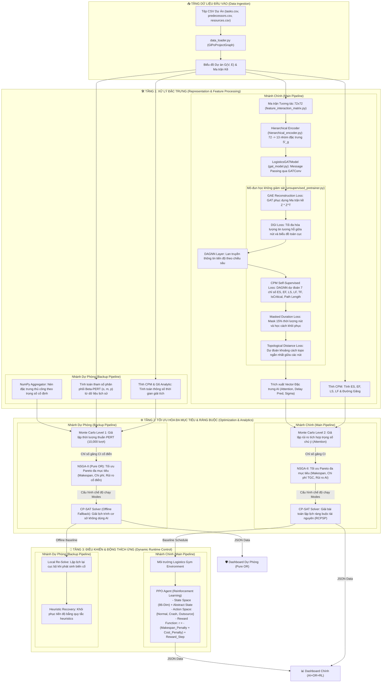

# Sơ đồ Luồng Dữ liệu (Data Workflow) - Kiến Trúc 3 Tầng GLPO

Tài liệu này đặc tả chi tiết luồng dữ liệu (Data Workflow) chạy qua hai nhánh xử lý song song: **Nhánh chính (Main Pipeline: AI + OR + RL)** và **Nhánh dự phòng (Backup Pipeline: Pure OR)**, bám sát kiến trúc 3 tầng của hệ thống quản lý tiến độ và chi phí logistics (GLPO).

---

## 1. Sơ đồ Luồng Dữ liệu Tổng thể (Mermaid Diagram)



---

## 2. Chi tiết các File và Mô-đun tại Tầng 1 (Feature & Model Representation)

### 📥 2.1 Tiền xử lý dữ liệu và Xây dựng Đồ thị
* **[data_loader.py](file:///c:/CNTT/KY8-2026/Logistics-Project-Progress-Cost-Management/ai_pipeline/models/data_loader.py) (`GlPoProjectGraph`):** Đọc các dữ liệu thô từ CSV và xây dựng thành cấu trúc đồ thị PyTorch Geometric `Data`. Đảm nhiệm việc map ID chuỗi sang index số (`node_to_idx` và `idx_to_node`).
* **[feature_interaction_matrix.py](file:///c:/CNTT/KY8-2026/Logistics-Project-Progress-Cost-Management/ai_pipeline/models/feature_interaction_matrix.py):** Định nghĩa ma trận liên kết tri thức thưa kích thước $72 \times 72$. Ma trận này đại diện cho tri thức chuyên gia về mối tương quan cộng hưởng hoặc đối kháng giữa các loại chi phí PMBOK và tham số tiến độ.

### 🧠 2.2 Bộ mã hóa phân cấp & Mô hình Lan truyền đồ thị
* **[hierarchical_encoder.py](file:///c:/CNTT/KY8-2026/Logistics-Project-Progress-Cost-Management/ai_pipeline/models/hierarchical_encoder.py) (`HierarchicalAttentionEncoder`):** Gom tụ 72 đặc trưng thô của nút thành 13 nhóm đặc trưng cô đọng ($S'_g$) thông qua hai tầng chú ý: chú ý nội bộ nhóm (Intra-group) và tầm ảnh hưởng chéo (Cross-group).
* **[gat_model.py](file:///c:/CNTT/KY8-2026/Logistics-Project-Progress-Cost-Management/ai_pipeline/models/gat_model.py) (`LogisticsGATModel`):** Nhận 13 nhóm đặc trưng đã nén, thực hiện cơ chế truyền tin (Message Passing) qua các nút liên kết để cập nhật sự ảnh hưởng giữa các công việc tiền nhiệm/kế nhiệm.

### 🛡️ 2.3 Mô-đun Tiền Huấn luyện Không Giám Sát & Tự Giám Sát (Unsupervised Pre-training)
Mô-đun **[unsupervised_pretrainer.py](file:///c:/CNTT/KY8-2026/Logistics-Project-Progress-Cost-Management/ai_pipeline/training/unsupervised_pretrainer.py)** thực thi hai giai đoạn huấn luyện đa nhiệm không cần nhãn ngoài:

#### 1. Giai đoạn tiền huấn luyện GAT (Warm-start GAT):
* **GAE Loss (Graph AutoEncoder):** Mô hình tối ưu hóa bằng cách so sánh ma trận kề gốc $A$ với ma trận kề phục dựng $\hat{A} = \sigma(Z Z^T)$ thu được từ tích vô hướng của node embeddings $Z$. Điều này ép GAT nắm giữ cấu trúc liên kết đồ thị.
* **DGI Loss (Deep Graph InfoMax):** Tối đa hóa lượng tin tương hỗ giữa biểu diễn nút cục bộ $Z_i$ và vector tóm tắt toàn bộ đồ thị $s$ thông qua bộ phân biệt song tuyến tính (Bilinear Discriminator). Giúp mô hình hiểu được ngữ cảnh toàn cục của dự án.

#### 2. Giai đoạn tiền huấn luyện DAGNN (Warm-start DAGNN):
* **CPM Self-Supervised Loss:** Dự đoán 7 chỉ số thời gian CPM tĩnh giải tích tính từ nút nguồn (Early Start, Early Finish, Late Start, Late Finish, Total Float, Is Critical, Path Length). Nhãn được sinh tự động bằng thuật toán CPM mà không cần dữ liệu lịch sử.
* **Masked Duration Loss:** Mask ngẫu nhiên $15\%$ thuộc tính thời lượng thực hiện của các công việc trên đồ thị, và huấn luyện bộ dự đoán khôi phục lại giá trị bị che giấu dựa trên cấu trúc các nút lân cận.
* **Topological Distance Loss:** Dự đoán khoảng cách topo ngắn nhất giữa các cặp nút ngẫu nhiên trên đồ thị dựa trên node embeddings của chúng, ép mô hình nắm giữ mối quan hệ khoảng cách phân cấp trong DAG.

---

## 3. Tầng 3: Mô tả PPO Agent (Học Tăng Cường Thích Ứng Runtime)

Khi dự án được triển khai thực tế, **PPO Agent** (Proximal Policy Optimization) giám sát trạng thái và đưa ra các quyết định điều chỉnh lịch trình động:

### 📊 3.1 Không gian Trạng thái (Observation State Space)
Không gian trạng thái đầu vào của Agent có kích thước **86 chiều (86-Dim)** bao gồm:
* Vector nhúng (Embedding) đại diện cấu trúc dự án từ GAT/DAGNN.
* Trạng thái thực tế tại thời điểm hiện tại của các công việc (đã xong, đang chạy, bị trễ bao nhiêu giờ).
* Ràng buộc toàn cục còn lại của dự án (Ngân sách còn lại, thời gian tới hạn chót còn lại).
* **Abstract State:** Trạng thái trừu tượng nén thông tin tiến độ tích lũy để giúp giảm kích thước trạng thái nhiễu, giúp Agent tập trung vào các điểm găng thực sự.

### ⚙️ 3.2 Không gian Hành động (Action Space)
Tại mỗi bước đưa ra quyết định khi phát hiện nguy cơ chậm trễ, Agent chọn 1 trong 3 hành động:
* **Hành động 0 (Normal):** Giữ nguyên tốc độ chạy chuẩn của công việc.
* **Hành động 1 (Crash):** Ép tiến độ (tăng ca, bổ sung nhân lực), tăng chi phí cục bộ nhưng giảm thời lượng đi $1.5$ lần.
* **Hành động 2 (Outsource):** Thuê ngoài hoàn toàn, giải phóng tài nguyên nội bộ, giảm thời lượng đi $2.0$ lần nhưng chịu chi phí cao nhất.

### 🏆 3.3 Thiết kế Hàm thưởng (Reward Function)
Hàm thưởng của Agent được thiết kế để phạt trực tiếp các vi phạm ràng buộc và thưởng cho các bước đi an sau:
$$Reward = - \beta_1 \cdot \max(0, Makespan - Deadline) - \beta_2 \cdot \max(0, Cost - Budget) + \gamma \cdot Step\_Reward$$
Trong đó:
- Phạt nặng nếu tổng thời lượng vượt quá hạn chót hoặc tổng chi phí vượt quá ngân sách.
- **Domain Randomization:** Trong quá trình huấn luyện, môi trường sẽ ngẫu nhiên thay đổi phân phối thời lượng các task (thêm nhiễu ngẫu nhiên) để mô phỏng sự bất định của thực tế, giúp PPO Agent có được chính sách điều khiển cực kỳ vững chãi (robust) khi gặp sự cố bất ngờ.

---

## 4. Cấu trúc thư mục của ai_pipeline (Directory Structure)

Thư mục `ai_pipeline` được tổ chức khoa học để phục vụ việc tiền xử lý dữ liệu, huấn luyện mô hình học sâu đồ thị (GNN), chạy mô phỏng và thực thi điều khiển tối ưu hóa đa mục tiêu:

```
ai_pipeline/
├── checkpoints/             # Lưu trữ các file checkpoint của mô hình (.pt, .pth)
│   ├── dagnn_pretrained.pth # Trọng số DAGNN sau khi tiền huấn luyện không giám sát đa nhiệm
│   ├── gat_pretrained.pth   # Trọng số GAT sau khi tiền huấn luyện không giám sát
│   ├── ppo_best.pt          # Trọng số tốt nhất của PPO Agent
│   ├── ppo_final.pt         # Trọng số cuối cùng của PPO Agent sau khi huấn luyện
│   └── training_log.json    # Lịch sử ghi nhận kết quả huấn luyện PPO
├── data/                    # Chứa dữ liệu đầu vào và kết quả đầu ra
│   ├── raw/                 # Dữ liệu dự án thô dạng JSON
│   ├── processed/           # Dữ liệu đồ thị dự án đã qua xử lý sang dạng CSV cho từng dự án
│   ├── etl_dslib_to_csv.py  # Script ETL chuyển đổi dữ liệu thô sang CSV
│   ├── output_[Project_ID]_main.json    # Kết quả lập lịch từ Main Pipeline cho các dự án
│   └── output_[Project_ID]_backup.json  # Kết quả lập lịch từ Backup Pipeline cho các dự án
├── envs/                    # Môi trường giả lập tích hợp cho Học Tăng Cường (RL)
│   ├── __init__.py          # Khởi tạo gói envs
│   └── logistics_gym_env.py # Định nghĩa Gym Environment cho bài toán lập lịch dự án
├── logs/                    # Ghi nhật ký huấn luyện và các chỉ số (metrics)
│   ├── dagnn_pretraining_metrics.json  # Chỉ số pretraining của DAGNN (CPM, Mask, Topo)
│   ├── gat_pretraining_metrics.json    # Chỉ số pretraining của GAT (GAE, DGI)
│   ├── ppo_training_metrics.json       # Chỉ số huấn luyện PPO Agent
│   └── pretraining_metrics.json        # Nhật ký tổng hợp chỉ số pretraining
├── models/                  # Các khối mô hình AI mạng nơ-ron chính
│   ├── __init__.py          # Khởi tạo gói models
│   ├── data_loader.py       # Nạp dữ liệu đồ thị PyTorch Geometric Graph từ CSV
│   ├── feature_interaction_matrix.py   # Ma trận quan hệ đặc trưng chi phí (72x72)
│   ├── hierarchical_encoder.py         # Bộ mã hóa đặc trưng nút phân cấp (72 -> 13)
│   ├── gat_model.py                    # Khối GATConv thực hiện lan truyền rủi ro cấu trúc
│   ├── dagnn_propagator.py             # Khối DAGNNPropagator lan truyền tô-pô dự án
│   ├── sequential_glpo_model.py        # Mô hình tích hợp Sequential GLPO Model (GAT + DAGNN)
│   ├── tgc_layer3.py                   # Tầng TGC Layer 3 tính toán chi phí quy đổi
│   └── RL_Handover_Guide.md            # Tài liệu bàn giao thiết kế mô hình RL
├── notebooks/               # Thư mục chứa các tài liệu phân tích dữ liệu dạng Jupyter Notebook
│   └── EDA_DSLIB.ipynb      # Phân tích dữ liệu thăm dò EDA cho dataset
├── src/                     # Chứa các thuật toán lõi Operations Research (OR) và Pipeline Runners
│   ├── algorithms/          # Thư viện thuật toán OR chính
│   │   ├── __init__.py      # Khởi tạo gói algorithms
│   │   ├── cpm.py           # Thuật toán CPM tĩnh tìm thời lượng sớm/trễ và đường găng
│   │   ├── pert.py          # Tính toán thông số PERT
│   │   ├── monte_carlo.py   # Mô phỏng rủi ro ngẫu nhiên Monte Carlo Level 2
│   │   ├── nsga2.py         # Tìm kiếm biên tối ưu Pareto đa mục tiêu
│   │   └── cpsat_solver.py  # Giải bài toán lập lịch ràng buộc tài nguyên thực tế (RCPSP)
│   ├── pipeline_runners/    # Tập lệnh thực thi chính
│   │   ├── run_main.py      # Kích hoạt toàn bộ Pipeline chính (AI + OR + RL)
│   │   └── run_backup.py    # Kích hoạt toàn bộ Pipeline dự phòng (Pure OR)
│   ├── data_processing.py   # Xử lý và ánh xạ dữ liệu thô
│   ├── load_to_db.py        # Nạp dữ liệu vào cơ sở dữ liệu
│   ├── protrack_etl.py      # Tiền xử lý dữ liệu ProTrack
│   └── update_notebook.py   # Cập nhật và xuất notebook phân tích
├── tests/                   # Các kịch bản chẩn đoán và kiểm thử thuật toán
│   ├── check_c2012_08.py    # Kiểm tra tính toán trên dự án lớn C2012-08
│   ├── demo_inference.py    # Chạy thử suy diễn mô hình AI
│   ├── solve_cpsat.py       # Kiểm thử giải lập lịch với CP-SAT
│   └── test_algorithms.py   # Kiểm thử các thuật toán CPM, PERT, MC, NSGA-II
├── training/                # Mã nguồn huấn luyện và tối ưu hóa tham số AI
│   ├── __init__.py          # Khởi tạo gói training
│   ├── ppo_trainer.py       # Huấn luyện PPO Agent thích ứng tiến độ động
│   ├── pretraining_losses.py # Định nghĩa các hàm loss tự giám sát (DGI, GAE, Topo, Mask)
│   ├── pretraining_utils.py  # Tiện ích bổ trợ cho pretraining (discriminator, BFS topo)
│   └── unsupervised_pretrainer.py    # Tiền huấn luyện đa nhiệm không giám sát cho GAT/DAGNN
└── requirements.txt         # Khai báo các thư viện Python phụ thuộc của dự án
```
