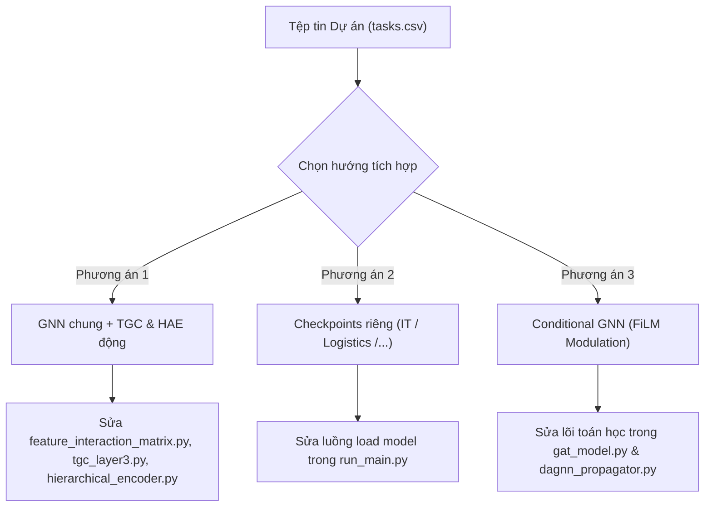

# LỘ TRÌNH TÍCH HỢP CƠ CHẾ LOẠI HÌNH DỰ ÁN (PROJECT TYPE INTEGRATION ROADMAP)
==================================================================================

Tài liệu này đặc tả lộ trình và các bước kỹ thuật chi tiết để tích hợp cơ chế Phân loại dự án (Project Type: IT, Business, Logistics,...) vào hệ thống GLPO dựa trên mã nguồn hiện tại.

---

## 🗺️ PHÂN TÍCH 3 PHƯƠNG ÁN KIẾN TRÚC



---

## 🛠️ CHI TIẾT CÁC BƯỚC TRIỂN KHAI CHO TỪNG PHƯƠNG ÁN

### 1. PHƯƠNG ÁN 1: Dùng chung GNN Backbone + Tải động Ma trận tương tác chi phí (Dynamic TGC & HAE)
* **Ý tưởng:** Các mạng GAT và DAGNN được huấn luyện chung để nắm bắt quy luật cấu trúc đồ thị chung. Nhưng tri thức kinh tế (Domain Knowledge) ở Tầng 1 và Tầng 3 sẽ thay đổi động theo từng loại dự án để tính toán chi phí quy đổi TGC và gom nhóm đặc trưng thô chính xác nhất.

#### 📋 Các file và dòng code cần chỉnh sửa:
* **[feature_interaction_matrix.py](file:///c:/CNTT/KY8-2026/Logistics-Project-Progress-Cost-Management/ai_pipeline/models/feature_interaction_matrix.py):**
  * Định nghĩa thêm các hàm sinh ma trận hệ số tương tác liên nhóm $\gamma$ cho IT và Business:
    ```python
    def _build_gamma_matrix_IT() -> np.ndarray:
        # Định nghĩa luật tương tác chi phí đặc thù của IT
        ...
    def _build_gamma_matrix_business() -> np.ndarray:
        # Định nghĩa luật tương tác chi phí đặc thù của Business
        ...
    ```
* **[hierarchical_encoder.py](file:///c:/CNTT/KY8-2026/Logistics-Project-Progress-Cost-Management/ai_pipeline/models/hierarchical_encoder.py):**
  * Cập nhật hàm `__init__` để nhận thêm tham số `project_type: str = "Logistics"`.
  * Cập nhật hàm khởi tạo ma trận tương tác tầng 2 để nạp động ma trận tương ứng ở bước trên.
* **[tgc_layer3.py](file:///c:/CNTT/KY8-2026/Logistics-Project-Progress-Cost-Management/ai_pipeline/models/tgc_layer3.py):**
  * Nhận tham số `project_type` ở constructor.
  * Định nghĩa lại `GROUP_NAMES` động theo loại hình dự án.
* **[run_main.py](file:///c:/CNTT/KY8-2026/Logistics-Project-Progress-Cost-Management/ai_pipeline/src/pipeline_runners/run_main.py) & [project_state_manager.py](file:///c:/CNTT/KY8-2026/Logistics-Project-Progress-Cost-Management/ai_pipeline/src/state/project_state_manager.py):**
  * Trích xuất trường `project_type` từ file dữ liệu đầu vào.
  * Truyền biến này vào khi khởi tạo `SequentialGLPOModel`.

---

### 2. PHƯƠNG ÁN 2: Tách biệt hoàn toàn Checkpoints (Separate Specialist Models)
* **Ý tưởng:** Huấn luyện riêng biệt các bộ mô hình chuyên hóa sâu cho từng miền dữ liệu. Dự án IT dùng checkpoint IT, dự án Logistics dùng checkpoint Logistics. Phương án này đơn giản nhất và không thay đổi bất kỳ dòng code toán học nào trong mô hình.

#### 📋 Các file và dòng code cần chỉnh sửa:
* **Quy trình Huấn luyện (SSL Offline & PPO):**
  * Phân chia tập dữ liệu huấn luyện ra các folder tương ứng: `data/processed/IT/`, `data/processed/Logistics/`.
  * Chạy pretraining và training PPO riêng biệt trên từng tập để lưu trữ các file weights khác tên:
    * `checkpoints/gat_pretrained_IT.pth` / `dagnn_pretrained_IT.pth`
    * `checkpoints/gat_pretrained_logistics.pth` / `dagnn_pretrained_logistics.pth`
* **[run_main.py](file:///c:/CNTT/KY8-2026/Logistics-Project-Progress-Cost-Management/ai_pipeline/src/pipeline_runners/run_main.py):**
  * Sửa đổi phần nạp weights (dòng 145-165) để đọc động theo loại hình dự án:
    ```python
    project_type = project_graph.project_type # Ví dụ: "it" hoặc "logistics"
    gat_path = os.path.join(checkpoint_dir, f"gat_pretrained_{project_type}.pth")
    dagnn_path = os.path.join(checkpoint_dir, f"dagnn_pretrained_{project_type}.pth")
    
    # Load weights
    model.load_state_dict(torch.load(dagnn_path, map_location=device), strict=False)
    ```

---

### 3. PHƯƠNG ÁN 3: Lớp điều hòa đặc trưng có điều kiện (FiLM)
* **Ý tưởng:** Thêm một mạng nơ-ron nhỏ học vector nhúng thể loại dự án (`project_type_emb`). Dùng vector này để hiệu chỉnh tuyến tính trạng thái ẩn của các lớp trong GAT và DAGNN thông qua kỹ thuật FiLM (Feature-wise Linear Modulation).

#### 📋 Các file và dòng code cần chỉnh sửa:
* **[sequential_glpo_model.py](file:///c:/CNTT/KY8-2026/Logistics-Project-Progress-Cost-Management/ai_pipeline/models/sequential_glpo_model.py):**
  * Thêm lớp Embedding: `self.project_type_emb = nn.Embedding(num_types, embedding_dim)`.
* **[gat_model.py](file:///c:/CNTT/KY8-2026/Logistics-Project-Progress-Cost-Management/ai_pipeline/models/gat_model.py) & [dagnn_propagator.py](file:///c:/CNTT/KY8-2026/Logistics-Project-Progress-Cost-Management/ai_pipeline/models/dagnn_propagator.py):**
  * Sửa signature hàm `forward` để nhận thêm vector nhúng loại hình.
  * Thêm các lớp tuyến tính phụ trợ để tính toán hệ số tỷ lệ $\gamma_{FiLM}$ và dịch chuyển $\beta_{FiLM}$ từ vector nhúng, sau đó nhân/cộng vào output ẩn của các layer GNN.

---

## 📈 LỘ TRÌNH TRIỂN KHAI KHUYÊN NGHỊ (RECOMMENDED PHASING)

Để đảm bảo hiệu năng và tiến độ phát triển bền vững, dự án nên đi qua các pha tích hợp sau:

* **Pha 1 (Kiểm chứng Specialization):** Áp dụng **Phương án 2 (Checkpoints riêng)**. Chỉ cần gom dữ liệu dự án IT để train một checkpoint GAT/DAGNN riêng, sau đó sửa cơ chế nạp động trong `run_main.py` để chạy thử nghiệm.
* **Pha 2 (Tích hợp Luật kinh tế chuyên biệt):** Áp dụng **Phương án 1 (Dynamic TGC)** để thiết kế riêng ma trận tương tác chi phí $\gamma$ cho IT và Business, giúp thuật toán PPO tối ưu hóa chi phí quy đổi sát với thực tế quản trị phần mềm hơn.
