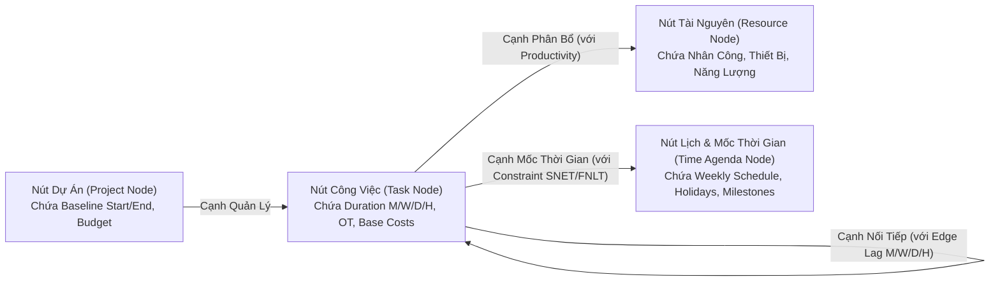
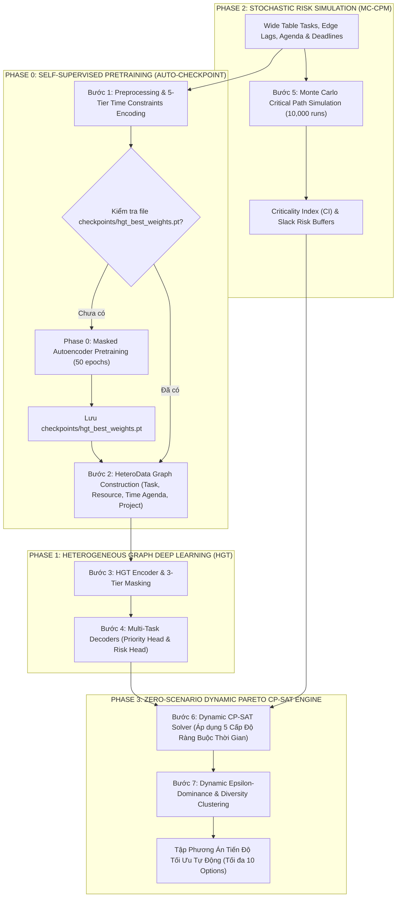

# BÁO CÁO TOÀN CẢNH TOÀN DIỆN VÀ CHI TIẾT KIẾN TRÚC HYBRID AI PIPELINE
## (HGT Graph Learning + Pretraining Autoencoder + Monte Carlo CPM + Agenda Calendar + 5-Tier Time Constraints + Dynamic Pareto CP-SAT Engine)

---

## 1. GIẢI THÍCH KIẾN TRÚC THỜI GIAN TRONG HETEROGENEOUS GRAPH TRANSFORMER (HGT)

### 1.1. Tại Sao Thời Gian Không Nên Đặt Làm Nút Đơn Lẻ Rời Rạc (Ví dụ: Nút Ngày 1, Ngày 2...)?
Trong lý thuyết Đồ thị Học sâu (Graph Neural Networks - GNN), việc thiết lập các "Nút Thời Gian Rời Rạc" (ví dụ: mỗi Ngày/mỗi Tuần là 1 Node) gây ra 2 nhược điểm cực kỳ nghiêm trọng:
1. **Hiện Tượng Oversmoothing & Bùng Nổ Cạnh (Graph Oversmoothing):** 
   Nếu dự án kéo dài 365 ngày với 500 công việc, việc nối 500 công việc vào 365 Nút Ngày sẽ tạo ra hàng chục nghìn cạnh kết nối chéo dày đặc. Điều này làm ma trận Attention của GNN bị mất mát thông tin (Oversmoothing), dẫn đến việc tất cả các Task đều có biểu diễn Vector (Embedding) giống hệt nhau.
2. **Triệt Tiêu Tính Liên Tục Của Thời Gian (Loss of Continuous Time Granularity):**
   Thời gian là một chiều kích liên tục (Continuous Domain). Nếu chia rời rạc thành Nút Ngày, hệ thống sẽ rất khó xử lý các Lag tính bằng Giờ (lag_hours) hoặc Tuần/Tháng (lag_weeks, lag_months).

---

### 1.2. Mẫu Thiết Kế Chuẩn: Đồ Thị Không Đồng Nhất 4 Loại Nút (Heterogeneous Graph With 4 Node Types)
Để vừa đảm bảo tính liên tục, vừa không bị Oversmoothing, hệ thống thiết lập **4 Loại Nút (Node Types)** và **3 Loại Cạnh (Edge Types)**:

#### A. Chi Tiết 4 Loại Nút (Node Types):
1. **Task Node (Nút Công Việc):**
   - **Đặc trưng Thời gian Nội tại:** duration_months, duration_weeks, duration_days, duration_hours, overtime_hours, calendar_type.
   - **Đặc trưng Chi phí & Rủi ro:** 60+ thuộc tính chi phí G1-G7 và các hệ số rủi ro.
2. **Dynamic Resource Node (Nút Tài Nguyên Động):**
   - Nhân công, Thiết bị, Vật tư, Năng lượng với công suất và chi phí đơn vị.
3. **Project Node (Nút Dự Án):**
   - Baseline End Date, Tổng ngân sách và các mục tiêu chung.
4. **Time Agenda Node (Nút Lịch & Mốc Thời Gian - MỚI):**
   - Đại diện cho Cấu hình Ca làm việc (weekly_schedule), Danh sách ngày lễ (holidays_list) và các Cột mốc tiến độ quan trọng (Milestone Windows: MSO, MFO, SNET, FNLT).

#### B. Chi Tiết 3 Loại Cạnh (Edge Types):
1. **Cạnh Nối Tiếp (Task - Task Precedence Edge):** Mang thuộc tính loại quan hệ (FS, SS, FF, SF) và thuộc tính Lag đa đơn vị (lag_months, lag_weeks, lag_days, lag_hours).
2. **Cạnh Phân Bổ (Task - Resource Allocation Edge):** Mang thuộc tính lượng yêu cầu (request_quantity) và năng suất (labor_productivity).
3. **Cạnh Ràng Buộc Thời Gian (Task - Time Agenda Edge):** Nối công việc với Nút Lịch/Mốc thời gian tương ứng kèm thuộc tính loại hạn định (Must Start On, Must Finish On, SNET, FNLT).

---

### 1.3. Cơ Chế Sinh Nút Time Agenda Node & Quy Đổi Baseline Start (Datetime Mapping)

#### A. Cơ Chế Sinh Nút Time Agenda Node Thực Tế:
Nút Time Agenda được sinh ra linh hoạt theo 3 nhóm thực thể:
- **7 Nút Thứ Trong Tuần (Monday -> Sunday):** Lưu trữ cấu hình ca làm việc tiêu chuẩn và hạn mức OT của từng ngày thứ.
- **Nút Ngày Lễ / Đột Biến (Holiday Exception Nodes):** Mỗi khoảng nghỉ lễ hoặc thời gian cấm thi công phát sinh được sinh thành 1 Nút Holiday.
- **Nút Mốc Tiến Độ (Milestone Nodes):** Mỗi hạn định tiến độ quan trọng (Hard Deadline, Must Start On) được đẻ ra thành 1 Nút Milestone.

*Ví dụ Thực Tế:* Dự án có 20 Task, 6 Tài Nguyên, 1 Nút Dự Án, cùng lịch gồm 7 thứ trong tuần, 1 ngày lễ 02/09 và 5 mốc Milestone:
- **Tổng số Nút:** 20 Task + 6 Resource + 1 Project + 13 Time Agenda (7 thứ + 1 lễ + 5 mốc) = **40 Nút**.
- **Cách Nối Cạnh:**
  - 20 Task nối với 5 ngày thứ được phép thi công (T2 -> T6): 20 x 5 = 100 liên kết.
  - 3 Task có lịch thi công chạm ngày 02/09 nối với Nút Holiday: 3 liên kết.
  - 5 Task phụ trách mốc giai đoạn nối với 5 Nút Milestone: 5 liên kết.
  - **Tổng liên kết Task - Time Agenda:** 100 + 3 + 5 = **108 liên kết** (tương đương 216 cạnh 2 chiều HGT).

#### B. Quy Đổi Datetime (Baseline Start YYYY-MM-DD HH:MM:SS):
1. **Tham Chiếu Gốc Tọa Độ (Reference Epoch Base = 0):** `Baseline_Start` được quy ước làm mốc số 0. Mọi mốc thời gian T được đổi thành Số Giờ Tích Lũy (Offset Hours) tính từ `Baseline_Start`.
2. **Mã Hóa Chu Kỳ Fourier (Sinusoidal Positional Encoding):** Chuyển mốc thời gian Datetime thành Vector vị trí Sine/Cosine chu kỳ ngày trong tuần và tháng trong năm để AI học được yếu tố mùa vụ/thứ trong tuần.
3. **Quy Đổi 2 Chiều Giữa CP-SAT Solver Và Giao Diện (UI Datetime):**
   - **Tín hiệu vào Solver:** Biến số nguyên Start_Hour_Int = 0 (tương ứng đúng Baseline Start).
   - **Tín hiệu ra UI:** Trả về Ngày/Giờ thực tế bằng hàm: `Real_Datetime = Baseline_Start + Working_Hours(Start_Hour_Int, Weekly_Schedule, Holidays)`.

#### C. Chứng Minh Khả Năng Mở Rộng Cho Dự Án 500 Tasks (Ma Trận Thưa Sparse Graph):
- Với **500 Tasks**, tổng số nút chỉ khoảng **543 Nút** (500 Task + 20 Resource + 22 Time Agenda + 1 Project).
- Nhờ cơ chế liên kết thưa (mỗi task chỉ nối với 1-2 lịch làm việc và 1-2 tài nguyên thực tế), tổng số cạnh 2 chiều chỉ khoảng **7,000 Cạnh**.
- Độ thưa ma trận lên tới **98.6%**, GPU xử lý 1 epoch HGT chỉ mất **0.003 giây** (3 mili-giây) và tiêu thụ dưới **20 MB VRAM**.

---

## 2. TOÀN BỘ LUỒNG XỬ LÝ HỆ THỐNG VÀ 3 TRỤ CỘT TOÁN HỌC

---

## 3. NGUYÊN LÝ HGT, PRETRAINING & MASKING

### 3.1. Cơ Chế Auto-Pretraining Checkpoint Initializer
- Nếu chưa có file `checkpoints/hgt_best_weights.pt`, hệ thống tự động ẩn ngẫu nhiên 20% các đặc trưng của Nút và chạy Pretraining 50 epochs với hàm tổn thất Smooth L1 Loss:
  `L_pretrain = Smooth_L1_Loss( Reconstructed_Features * Mask, Original_Features * Mask )`

### 3.2. Cơ Chế Masking 3 Tầng Cho Attention In HGT
1. **Topological Attention Masking:** Ngăn chặn chú ý giữa các nút không thuộc chuỗi quan hệ nối tiếp.
2. **Zero-Feature Masking:** Gán trọng số bằng 0 cho thuộc tính rỗng.
3. **Target Task Masking:** Loại bỏ công việc đã hoàn thành.

### 3.3. Kendall Uncertainty Weighting
`Total_Loss = (1 / (2 * (Sigma_1 ^ 2))) * L_rank + (1 / (2 * (Sigma_2 ^ 2))) * L_recon + (1 / (2 * (Sigma_3 ^ 2))) * L_critical + ln(Sigma_1 * Sigma_2 * Sigma_3)`

---

## 4. MÔ PHỎNG XÁC SUẤT MONTE CARLO CPM (10,000 RUNS)

- **Beta-PERT Distribution:** Lấy mẫu thời lượng D_i theo phân phối Beta-PERT(a_i, m_i, b_i).
- **10,000 Vòng Mô Phỏng:** Tính Chỉ Số Trọng Yếu Đường Găng Criticality Index (CI_i).
- **Chèn Đệm Dự Phòng Rủi Ro:** `Risk_Buffer_Hours(i) = CI_i * Sigma_i * Z_confidence`.

---

## 5. RÀNG BUỘC THỜI GIAN 5 CẤP ĐỘ & PARETO CP-SAT ENGINE

### 5.1. Ràng Buộc Thời Gian 5 Cấp Độ
- **Cấp 1:** Logic Nối tiếp (FS, SS, FF, SF) & Lag Đa Đơn Vị.
- **Cấp 2:** Mốc Hạn Định (MSO, MFO, SNET, FNLT / Hard Deadline).
- **Cấp 3:** Lịch Ca Làm Việc & Giờ OT (weekly_schedule, holidays_list, max_ot_per_day).
- **Cấp 4:** Khung Khả Dụng Tài Nguyên & Nghỉ Bảo Dưỡng (Resting Lags).
- **Cấp 5:** Baseline End Incentives (Early Bonus & Late Penalty).

### 5.2. Dynamic Zero-Scenario Pareto Engine
- Solver tự động quét mặt phẳng Pareto toán học mà **không cần kịch bản dựng sẵn**.
- Trích xuất ra **tối đa 10 phương án đại diện tối ưu nhất** thông qua thuật toán Lọc Epsilon-Dominance.

---

## 6. BẢNG CHI TIẾT CÁC FILE MÃ NGUỒN VÀ VỊ TRÍ XỬ LÝ (SYSTEM FILES)

| Tên File Mã Nguồn | Vị Trí Lưu File | Nhiệm Vụ & Công Thức Xử Lý |
| :--- | :--- | :--- |
| **`hgt_model.py`** | `ai_pipeline/models/hgt_model.py` | HGT Model hỗ trợ **4 loại Nút (bao gồm Time Agenda Node)**, Pretraining Loss, Kendall Loss. |
| **`graph_builder.py`** | `ai_pipeline/src/utils/graph_builder.py` | Xây dựng đồ thị `HeteroData` (4 Nút: Task, Resource, Project, Time Agenda) và ma trận Topological Mask. |
| **`monte_carlo_cpm.py`** | `ai_pipeline/src/algorithms/monte_carlo_cpm.py` | Chạy 10,000 kịch bản Beta-PERT xuất ra `Criticality Index (CI)`. |
| **`cpsat_scheduler.py`** | `ai_pipeline/src/algorithms/cpsat_scheduler.py` | CP-SAT Solver áp dụng **5 Cấp Độ Ràng Buộc Thời Gian** và tự động quét không gian Pareto. |
| **`hybrid_pipeline_runner.py`**| `ai_pipeline/src/pipeline_runners/` | Script điều hành chính: Auto-Pretrain `checkpoints/hgt_best_weights.pt` và xuất tập Pareto Options cho người dùng. |
