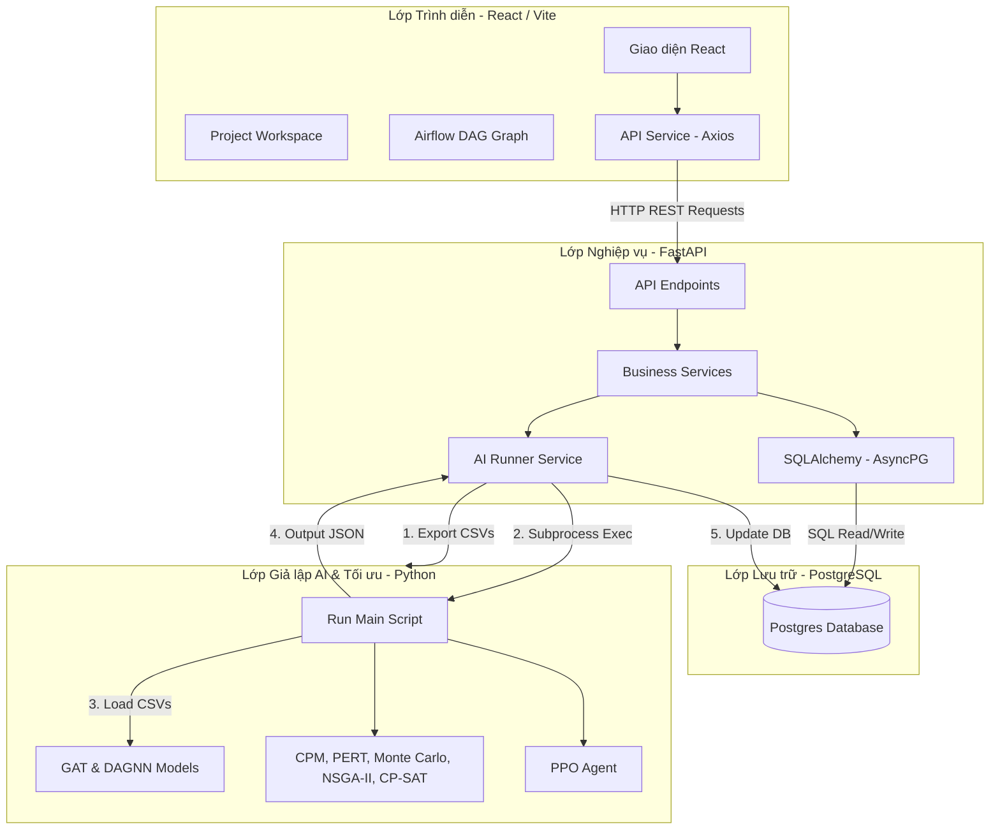
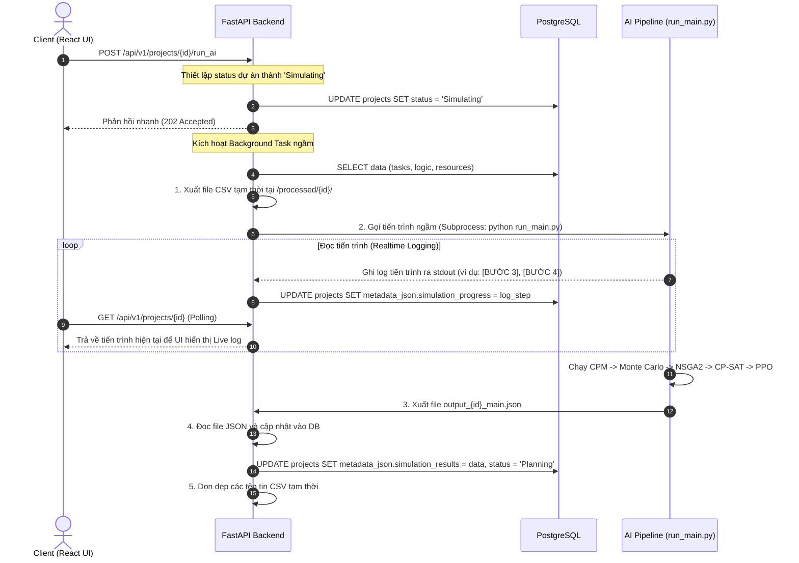

# Tài liệu Kiến trúc Hệ thống GLPO (Graph-based Logistics Project Optimization)

Tài liệu này cung cấp cái nhìn toàn diện về kiến trúc, cấu trúc tệp tin, luồng hoạt động chính, mô hình cơ sở dữ liệu và cơ chế giả lập AI của nền tảng GLPO.

---

## 1. Tổng quan Kiến trúc Hệ thống (System Architecture Overview)

GLPO là một nền tảng lập lịch và tối ưu hóa dự án logistics thông qua phân tích đồ thị kết hợp Học sâu (GNN), Học tăng cường (RL) và Tối ưu hóa ràng buộc (Constraint Programming). Hệ thống được chia thành 3 phần chính:

---

## 2. Chi tiết Cấu trúc Tệp tin (Directory Structure)

### 2.1. Frontend (`frontend/src/`)
Frontend được xây dựng bằng React, Vite, TypeScript và TailwindCSS.
- [App.tsx](file:///E:/University/Year%203%20-%203/DA3/frontend/src/App.tsx): Quản lý Routing và cấu hình Layout.
- **`pages/`**: Các màn hình chính.
  - [Dashboard.tsx](file:///E:/University/Year%203%20-%203/DA3/frontend/src/pages/Dashboard.tsx): Hiển thị dashboard tổng quan về hiệu năng, ngân sách, makespan.
  - [ProjectList.tsx](file:///E:/University/Year%203%20-%203/DA3/frontend/src/pages/ProjectList.tsx): Danh sách các dự án.
  - [Workspace.tsx](file:///E:/University/Year%203%20-%203/DA3/frontend/src/pages/Workspace.tsx): Không gian làm việc chi tiết của dự án (Gantt chart, KPIs, live AI simulation logs, Recommendations).
  - [AirflowGraph.tsx](file:///E:/University/Year%203%20-%203/DA3/frontend/src/pages/AirflowGraph.tsx): Vẽ biểu đồ mạng công việc hình cây (DAG) sử dụng Canvas hoặc SVG trực quan.
- **`components/`**: Các thành phần UI dùng chung và modal quản lý.
  - [ResourceManagerModal.tsx](file:///E:/University/Year%203%20-%203/DA3/frontend/src/components/ResourceManagerModal.tsx): Phân bổ tài nguyên.
  - [TaskFormModal.tsx](file:///E:/University/Year%203%20-%203/DA3/frontend/src/components/TaskFormModal.tsx): Thêm/sửa công việc với các thông số chi phí chi tiết.
- **`services/`**:
  - [api.ts](file:///E:/University/Year%203%20-%203/DA3/frontend/src/services/api.ts): Các hàm gọi Axios API trao đổi dữ liệu với FastAPI backend.

### 2.2. Backend (`backend/app/`)
Backend thiết kế theo mô hình Repository-Service clean architecture sử dụng FastAPI và SQLAlchemy.
- **`api/endpoints/`**: Lớp định nghĩa API Routes.
  - [projects.py](file:///E:/University/Year%203%20-%203/DA3/backend/app/api/endpoints/projects.py): API CRUD dự án, và endpoint kích hoạt mô phỏng chạy ngầm (`/run_ai`).
  - [tasks.py](file:///E:/University/Year%203%20-%203/DA3/backend/app/api/endpoints/tasks.py): Quản lý công việc.
  - [constraints.py](file:///E:/University/Year%203%20-%203/DA3/backend/app/api/endpoints/constraints.py): Quản lý tài nguyên, schedule và logic ràng buộc.
  - [ai.py](file:///E:/University/Year%203%20-%203/DA3/backend/app/api/endpoints/ai.py): Mô phỏng cost model tĩnh.
- **`models/`**: Khai báo SQLAlchemy Database Models.
  - [project.py](file:///E:/University/Year%203%20-%203/DA3/backend/app/models/project.py), [task.py](file:///E:/University/Year%203%20-%203/DA3/backend/app/models/task.py), [constraint.py](file:///E:/University/Year%203%20-%203/DA3/backend/app/models/constraint.py).
- **`services/`**: Lớp chứa logic nghiệp vụ chính.
  - [ai_runner.py](file:///E:/University/Year%203%20-%203/DA3/backend/app/services/ai_runner.py): Điều phối quá trình tạo thư mục tạm, xuất dữ liệu CSV, gọi Subprocess chạy ngầm AI pipeline, đọc log stdout thời gian thực để cập nhật progress và ghi đè kết quả mô phỏng vào DB.

### 2.3. AI Pipeline (`ai_pipeline/`)
Nơi xử lý mô hình hóa thuật toán tối ưu và AI.
- **`src/pipeline_runners/`**:
  - [run_main.py](file:///E:/University/Year%203%20-%203/DA3/ai_pipeline/src/pipeline_runners/run_main.py): Luồng điều phối chính nhận đầu vào `project_id`, chạy GNN dự đoán rủi ro/delay, chạy mô phỏng Monte Carlo, NSGA-II, Google CP-SAT và PPO Agent, xuất kết quả ra file JSON.
- **`src/algorithms/`**:
  - [cpm.py](file:///E:/University/Year%203%20-%203/DA3/ai_pipeline/src/algorithms/cpm.py): Lập lịch CPM tĩnh.
  - [pert.py](file:///E:/University/Year%203%20-%203/DA3/ai_pipeline/src/algorithms/pert.py): Phân tích PERT 3 điểm thời lượng.
  - [monte_carlo.py](file:///E:/University/Year%203%20-%203/DA3/ai_pipeline/src/algorithms/monte_carlo.py): Giả lập Monte Carlo (1000 lượt) tính toán phân vị P90 và chỉ số nhạy cảm (Criticality Index).
  - [nsga2.py](file:///E:/University/Year%203%20-%203/DA3/ai_pipeline/src/algorithms/nsga2.py): Tối ưu hóa đa mục tiêu thời gian - chi phí - rủi ro (Pareto Frontier).
  - [cpsat_solver.py](file:///E:/University/Year%203%20-%203/DA3/ai_pipeline/src/algorithms/cpsat_solver.py): Google OR-Tools CP-SAT Solver lập lịch tối ưu chính xác có ràng buộc tài nguyên (RCPSP).
- **`models/`**:
  - [gat_model.py](file:///E:/University/Year%203%20-%203/DA3/ai_pipeline/models/gat_model.py): Mô hình Graph Attention Network.
  - [hierarchical_encoder.py](file:///E:/University/Year%203%20-%203/DA3/ai_pipeline/models/hierarchical_encoder.py): Gom đặc trưng thành các nhóm thông qua attention phân cấp.
  - [tgc_layer3.py](file:///E:/University/Year%203%20-%203/DA3/ai_pipeline/models/tgc_layer3.py): Mô hình hóa chi phí tổng quát TGC (Total Generalized Cost).

---

## 3. Sơ đồ Thực thể Cơ sở Dữ liệu (Database ERD Summary)

Cơ sở dữ liệu PostgreSQL lưu giữ trạng thái dự án, các thông số ràng buộc và kết quả sau khi tối ưu:

- **`projects`**: Lưu thông tin dự án, ngân sách, deadline, và cột `metadata_json` chứa toàn bộ kết quả mô phỏng (CPM, CP-SAT, Monte Carlo, PPO).
- **`tasks`**: Lưu danh sách các công việc thuộc dự án, thời lượng (planned, actual), chi phí chi tiết (nhân công, thiết bị, vận chuyển, QC, rủi ro, lưu kho, pháp lý, ESG...).
- **`project_constraint_logic`**: Ràng buộc thứ tự công việc (Predecessor -> Successor, loại quan hệ: FS, SS, FF, SF và Lag hours).
- **`project_constraint_resource`**: Định nghĩa danh mục tài nguyên của dự án và số lượng khả dụng tối đa.
- **`task_resources`**: Bảng trung gian định nghĩa số lượng tài nguyên cần thiết cho từng công việc cụ thể.

---

## 4. Luồng xử lý Giả lập AI (Simulation Execution Sequence)

Luồng trao đổi thông tin khi người dùng nhấn nút **"Run AI Simulation"**:

---

## 5. Các mô hình và thuật toán AI cốt lõi

1. **Graph Attention Network (GAT):**
   - Đồ thị dự án được biểu diễn với các Node là các Tasks, Edge là quan hệ phụ thuộc.
   - GAT học các biểu diễn đặc trưng (Embeddings) của nút dựa trên độ ảnh hưởng của các nút láng giềng.
2. **Hierarchical Attention Encoder:**
   - Gom 72/91 đặc trưng thô của nút thành 8/12 nhóm chi phí và ràng buộc. Giúp mô hình hóa cấu trúc domain knowledge của quản trị dự án (PMBOK).
3. **Monte Carlo Level 2:**
   - Chạy giả lập 1000 kịch bản dựa trên phân phối xác suất thời lượng (từ dự báo của GNN) để tính toán độ biến động thời gian dự án, độ nhạy cảm của các đường dẫn.
4. **CP-SAT Solver:**
   - Giải thuật Constraint Programming tối ưu chính xác ngày bắt đầu và kết thúc của từng công việc đảm bảo không vượt quá giới hạn tài nguyên của dự án theo thời gian.
